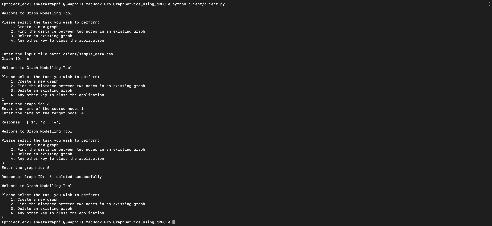

# GraphService using gRPC

## Objective

The network service should be able to perform the following operations 

- Post a graph, returning an ID to be used in subsequent operations
- Get the shortest path between two vertices in a previously posted graph
- Delete a graph from the server

## How to run

To start the server run the below shell script

> _sh run_server.sh_

After starting the server,in a new terminal start the client by excecuting the below command

> _sh run_client.sh_

This will trigger an interactive terminal in which the user can interact with the server. The screenshot below shows all the 3 operations. System is designed to accept graphs from csv files containing edges. Each row of the csv file contains a source and target node. If a standalone node needs to be inserted then one can leave the target/source csv entry blank or write "nan".  

## Testing and Results

### Unit Tests

All 3 server functionalities are unit tested and can be verified by running

python server/test_server_unittest.py

Results for the unit test

### Functionality testing

All three server functionalites have be tested and can be verfied by running

python client/test_functionality.py

Results for the Functional test

### Performance Testing

ghz framework (https://ghz.sh/) is used for performing performance testing. The service effectively handles concurrency, mulitple clients. Results for the same can be seen in the output file generated placed in tests/performance_tests/ghz_performance_result_increasing_load.txt. The configuration file present is used to check the "get shortest path" objective, so the server should have a graph to do performance testing.

To replicate the results

- Start the server and create a graph using the client and sample_data.csv file placed in the folder

- Install ghz as the per the instructions on the website or 
> _brew install ghz_

- Then run the below command
> _ghz --config tests/performance_tests/config.json_

The parameters in the config file can be manipulated to test other scenarios if needed.

## Technology Stack
- ghz testing framework
- gRPC networking protocol
- networkx as a graph library
- pandas for data manipulation

